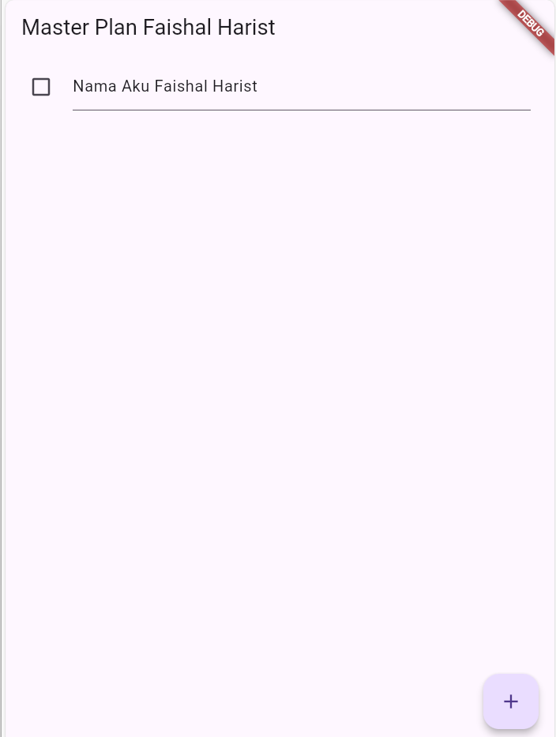
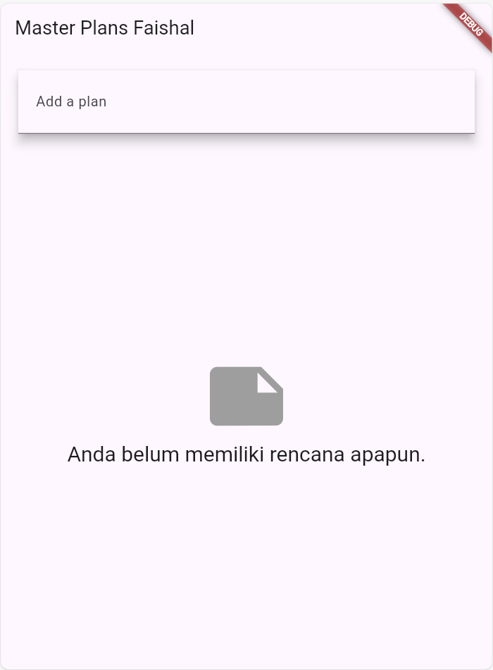
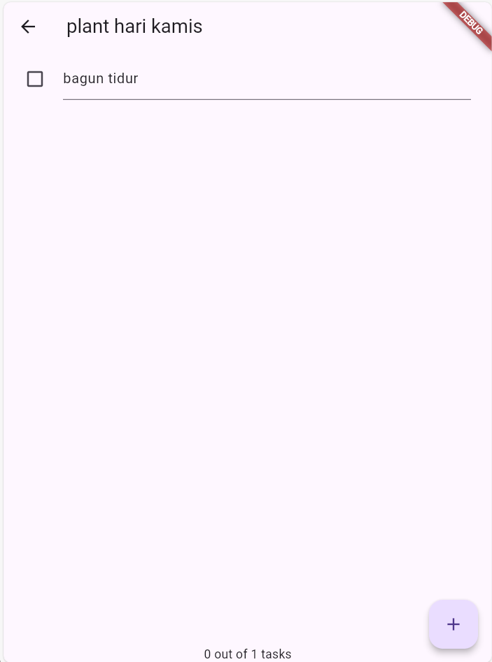
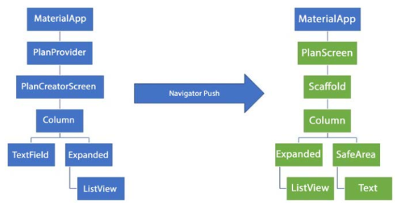

# Laporan Praktikum Codelabs #10

## Identitas Mahasiswa
| Nama | Kelas | Absen |
|------|-------|-------|
| Faishal Harist Rahmawan | TI-3H | 10 |

---

## Praktikum 1

**Output:**



### Tugas 2  
**Pertanyaan:** Apa maksud dari langkah 4, dan mengapa dilakukan demikian?

**Penjelasan:**  
Pada langkah ini dibuat file `data_layer.dart` yang berperan sebagai *barrel file* untuk mengelola semua export dari file model dalam satu tempat.  

**Tujuan pembuatannya:**
- Menghemat penulisan kode import karena hanya perlu satu file utama.
- Mempermudah pemeliharaan kode saat menambahkan model baru.
- Menjadikan struktur direktori lebih bersih dan terorganisir.  

**Perbandingan:**

```dart
// Sebelum
import 'package:master_plan/models/plan.dart';
import 'package:master_plan/models/task.dart';

// Sesudah
import 'package:master_plan/models/data_layer.dart';
```


Dengan begitu, `data_layer.dart` berfungsi sebagai pusat ekspor model yang membuat pengelolaan dependensi lebih efisien.

---

### Tugas 3  
**Pertanyaan:** Mengapa dibutuhkan variabel `plan` pada langkah 6? Mengapa menggunakan konstanta?

**Penjelasan:**  
Variabel `plan` berfungsi menyimpan informasi state dari objek `Plan` yang berisi daftar task pada `PlanScreen`.

**Alasan penggunaan:**
- Menjadi wadah utama data yang akan dimanipulasi di layar.  
- Mendukung perubahan data melalui mekanisme `setState()`.  
- Memastikan semua widget menggunakan sumber data yang sama (single source of truth).

**Tentang `const Plan()`:**
- Memberi nilai awal kosong sebagai state awal.
- Hanya bersifat konstanta pada proses inisialisasi, bukan membuat state tidak bisa diubah.
- Sedikit membantu efisiensi penggunaan memori.

```dart
setState(() {
plan = Plan(name: 'Rencana Baru', tasks: []);
});
```

Jadi `const Plan()` hanya berfungsi sebagai nilai awal sebelum state dinamis diubah oleh pengguna.

---

### Tugas 5  
**Pertanyaan:** Apa fungsi method yang disebut di langkah 11 dan 13 pada siklus state?

**Jawaban:**

**Langkah 11 - `initState()`**  
Merupakan metode pertama yang dijalankan saat widget dibuat.  
Digunakan untuk:
- Inisialisasi objek `ScrollController`.  
- Menambahkan listener agar keyboard tertutup otomatis ketika pengguna melakukan scroll.  
- Menyiapkan resource sebelum UI mulai dibangun.

Urutan eksekusi:  
`initState() → build() → tampil di layar`

**Langkah 13 - `dispose()`**  
Metode ini berjalan ketika widget dihapus dari *widget tree*.  
Fungsinya:
- Membebaskan resource seperti `ScrollController`.  
- Menghindari kebocoran memori.  
- Memastikan metode `super.dispose()` tetap dipanggil agar seluruh proses pembersihan berjalan sempurna.  

Urutan eksekusi:  
`Widget dihapus → dispose() → resources dilepas`

---

## Praktikum 2

**Output:**


### Tugas 2  
**Pertanyaan:** Apa yang dimaksud dengan InheritedWidget di langkah 1, dan mengapa menggunakan InheritedNotifier?

**Penjelasan:**  
Pada bagian ini, `PlanProvider` dideklarasikan sebagai subclass dari `InheritedNotifier<ValueNotifier<Plan>>`, yang artinya secara tidak langsung juga merupakan `InheritedWidget`.

```dart
// Sebelum
int get completedCount => tasks.where((task) => task.complete).length;

String get completenessMessage =>
'$completedCount out of ${tasks.length} tasks';
```


**Makna dan Fungsinya:**
- `completedCount` menghitung jumlah tugas yang sudah selesai dari seluruh daftar.  
- `completenessMessage` menyusun pesan status kemajuan seperti “3 out of 5 tasks”.  

**Tujuan dibuat di model (bukan di UI):**
- Logika dihimpun di bagian *model* agar tidak bercampur dengan tampilan.  
- Memudahkan pemanggilan ulang dari berbagai widget.  
- Mematuhi prinsip DRY (Don’t Repeat Yourself).  
- Getter otomatis menghitung ulang nilai setiap kali task berubah.  

Pemanggilan di UI cukup sederhana:


```dart
Text(plan.completenessMessage)

```
Hal ini membuat kode lebih rapi dan mudah dipelihara.

---

## Praktikum 3

**Output:**

\
\

### Tugas 2  
**Pertanyaan:** Jelaskan arti diagram berikut berdasarkan hasil praktikum 3!  


**Penjelasan Diagram:**  
Gambar tersebut menunjukkan struktur pengelolaan state menggunakan `InheritedNotifier` yang membungkus beberapa layar dengan `Navigator`.

1. **MaterialApp (Root Widget)**  
   Menjadi wadah utama seluruh aplikasi Flutter, menyediakan tema dan routing.

2. **PlanProvider (InheritedNotifier Layer)**  
   Menjadi lapisan global tempat semua data `List<Plan>` disimpan serta dipantau perubahan nilainya.

3. **Navigator**  
   Mengatur perjalanan antar screen seperti membuka atau menutup halaman baru.

4. **PlanCreatorScreen**  
   - Bertugas menampilkan dan menambah plan baru.  
   - Mengambil data dari `PlanProvider` dan dapat memodifikasinya.  
   - Menavigasi ke halaman detail plan saat salah satu item dipilih.  

5. **PlanScreen**  
   - Menampilkan detail task untuk plan tertentu.  
   - Mengizinkan pengguna mengubah status, menambah, atau menghapus task.  
   - Data tersinkron langsung dengan provider utama.

**Inti dari Diagram:**  
Model ini menerapkan pola *Shared State via InheritedNotifier* di mana semua screen berbagi *state* yang sama tanpa harus mengoper data secara manual. State disimpan di lapisan atas sehingga setiap perubahan otomatis tercermin di semua screen.
Desain ini memungkinkan aplikasi lebih mudah dikelola dan tetap konsisten di seluruh tampilan.

---
