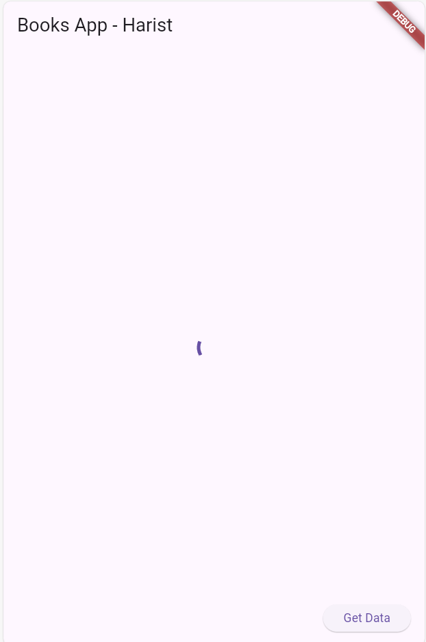
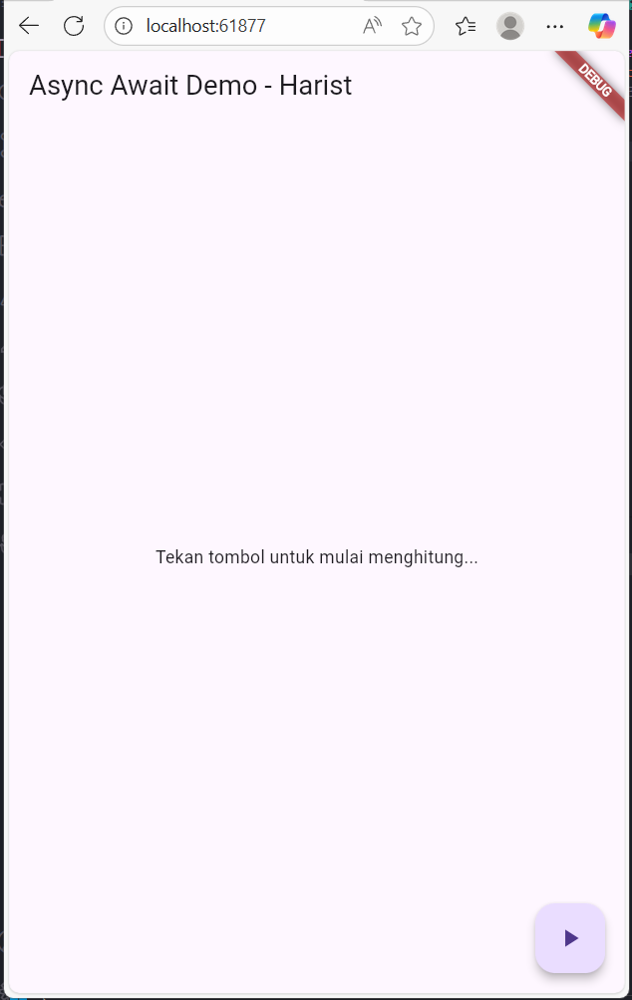
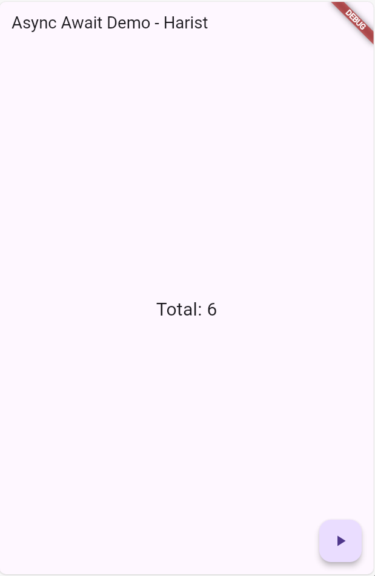
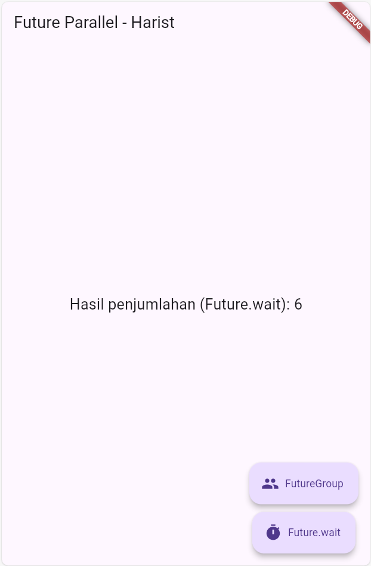
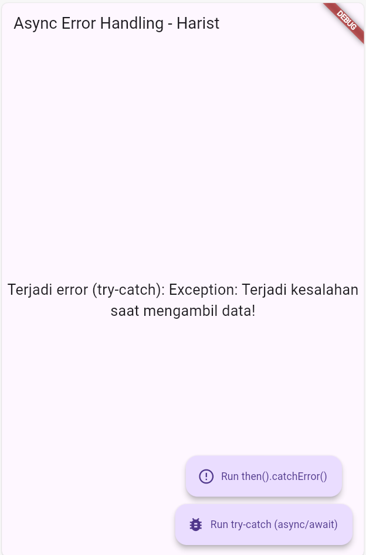
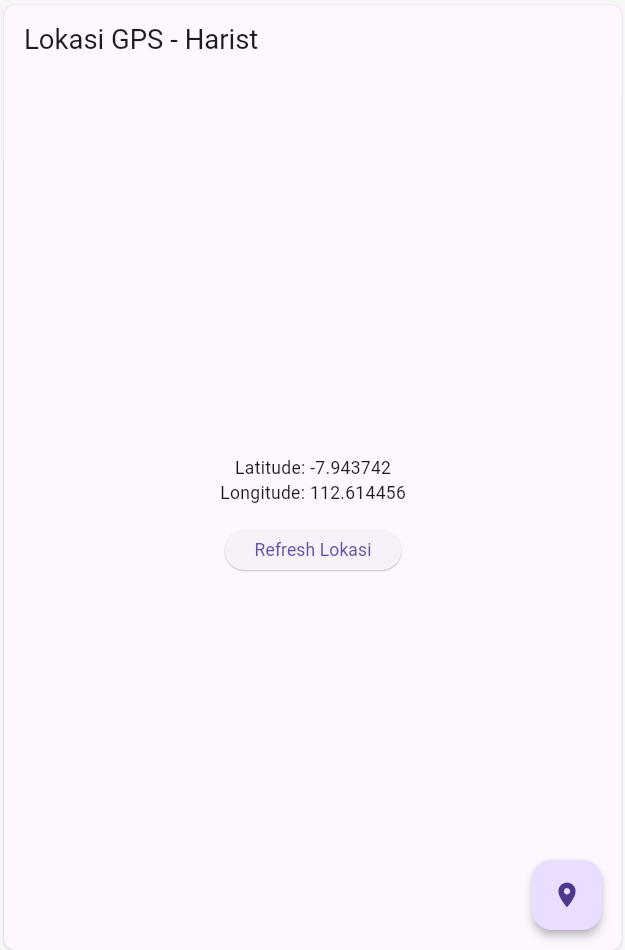
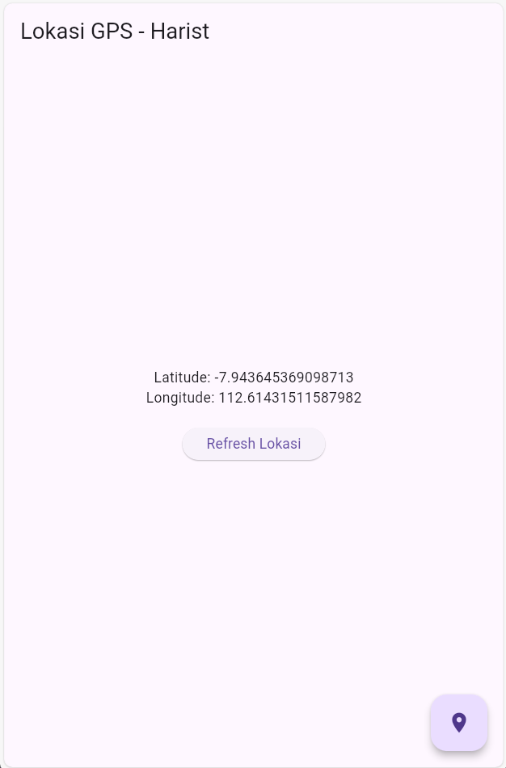
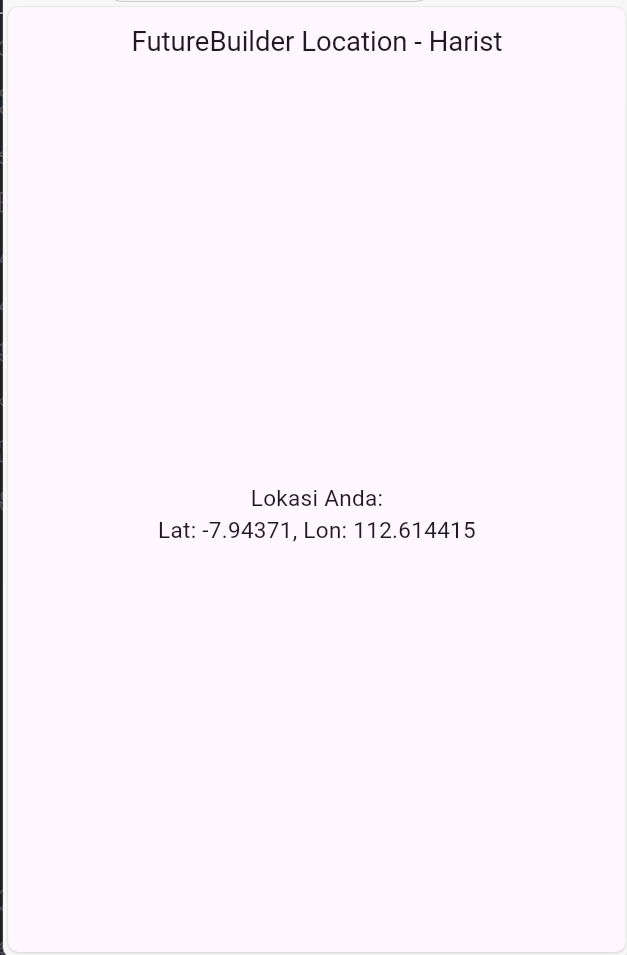
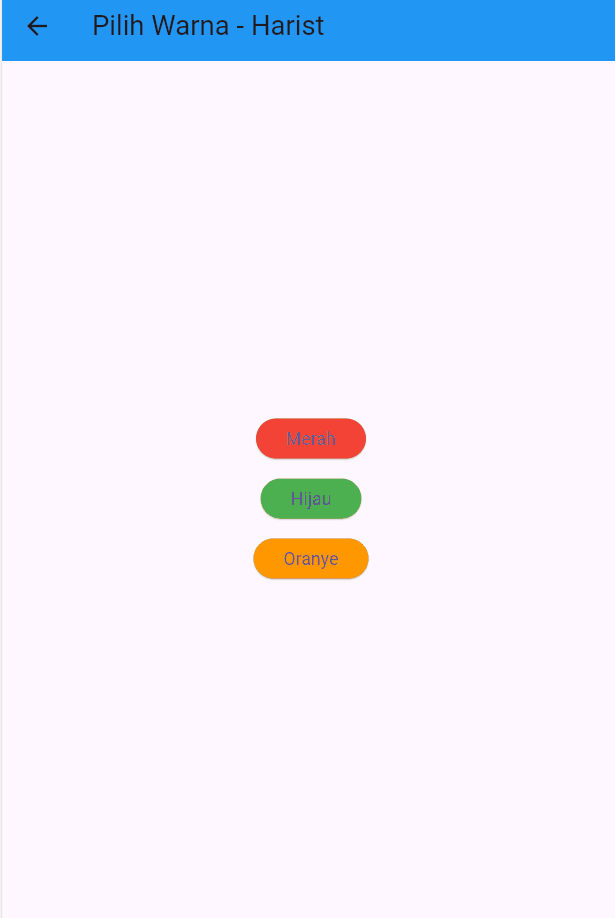
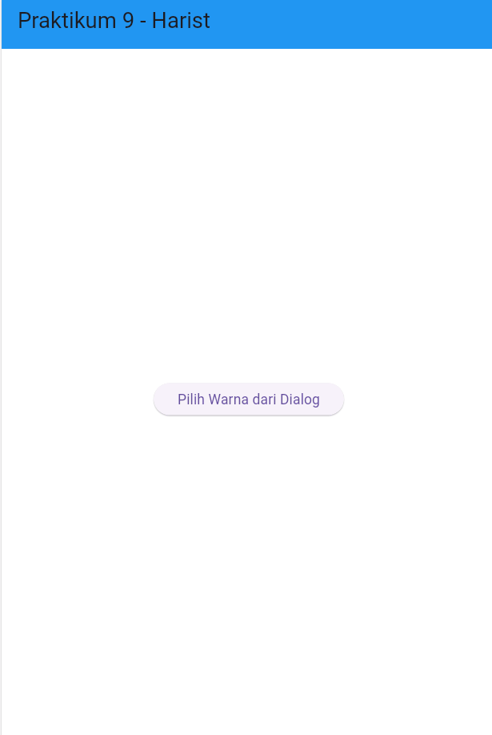

# Laporan Praktikum Codelabs #11
# 🧾 LAPORAN PRAKTIKUM CODING ASYNC, FUTURE, DAN NAVIGATION

## Identitas Mahasiswa
| Nama | Kelas | Absen |
|------|-------|-------|
| Faishal Harist Rahmawan | TI-3H | 10 |

## 🧩 Praktikum 1 – Menerapkan Async pada Dart
**Output:**

**Soal 1:**  
Apa fungsi keyword `async` dan `await` pada Dart?  
**Jawaban:**  
`async` digunakan untuk menandai sebuah fungsi agar dapat menjalankan operasi asynchronous.  
`await` digunakan di dalam fungsi async untuk menunggu hasil dari operasi asynchronous sebelum melanjutkan eksekusi kode berikutnya.

**Soal 2:**  
Apa hasil output ketika menjalankan kode dengan `Future.delayed()`?  
**Jawaban:**  
`Future.delayed()` menunda eksekusi kode di dalamnya selama durasi tertentu. Output akan muncul setelah waktu tunda selesai, sedangkan baris lain di bawahnya tetap berjalan terlebih dahulu (non-blocking).

---

## Praktikum 2 – Membuat Fungsi Future

**Output:**

**Soal 3:**  
Apa fungsi Future pada Dart?  
**Jawaban:**  
`Future` merepresentasikan operasi yang akan selesai di masa depan, seperti menunggu data dari server, membaca file, atau delay. Hasil dari Future bisa berupa nilai sukses atau error (*exception*).

**Soal 4:**  
Bagaimana cara menampilkan hasil Future di console?  
**Jawaban:**  
Gunakan `.then()` untuk menangkap hasil ketika Future selesai, atau gunakan `await` di dalam fungsi `async` agar hasil bisa langsung disimpan ke variabel dan ditampilkan.

---

## Praktikum 3 – Menangani Future dengan then() dan async/await
**Output:**

**Soal 5:**  
Apa perbedaan penggunaan `then()` dan `async/await`?  
**Jawaban:**  
`.then()` menggunakan callback function dan lebih cocok untuk *chaining* beberapa Future.  
`async/await` lebih mudah dibaca karena membuat kode asynchronous tampak seperti kode synchronous.

**Soal 6:**  
Apa keuntungan menggunakan `async/await`?  
**Jawaban:**  
Kode menjadi lebih bersih, mudah dipahami, dan meminimalkan callback hell saat menangani banyak operasi asynchronous.

---

## Praktikum 4 – Menampilkan Data Asynchronous
**Output:**

**Soal 7:**  
Mengapa data asynchronous perlu di-*handle* dengan `setState()`?  
**Jawaban:**  
Karena ketika data asynchronous selesai dimuat, UI perlu diperbarui agar menampilkan data terbaru. Pemanggilan `setState()` memberi tahu Flutter bahwa ada perubahan state yang harus dirender ulang di layar.

**Soal 8:**  
Apa hasil jika `setState()` tidak dipanggil?  
**Jawaban:**  
UI tidak akan berubah walaupun data sudah diterima, karena Flutter tidak tahu bahwa ada update pada variabel di dalam state widget.

---

## Praktikum 5 – Menangani Error pada Async Code
**Output:**
 

**Soal 9:**  
Apa yang ditampilkan di debug console ketika menjalankan `then()` dengan `Future.delayed()`?  
**Jawaban:**  
Pesan “Complete” akan muncul di console setelah delay selesai, menandakan Future sudah selesai dieksekusi.

**Soal 10:**  
Apa perbedaan antara kode pada langkah 1 (tanpa error handling) dan langkah 4 (dengan `handleError()`)?
**Jawaban:**  
Pada langkah 1, error tidak ditangani sehingga jika terjadi kesalahan, program akan crash.  
Sedangkan pada langkah 4, error ditangani dengan `handleError()` atau `try–catch`, sehingga error akan ditampilkan atau ditangani tanpa membuat aplikasi berhenti.

---

## Praktikum 6 – Menampilkan Lokasi dengan Geolocator
**Output:**

**Soal 11:**  
Mengapa aplikasi perlu meminta izin lokasi?  
**Jawaban:**  
Karena akses lokasi merupakan data sensitif. Android/iOS mensyaratkan permission eksplisit agar aplikasi diizinkan mengakses GPS.

**Soal 12:**  
Apa fungsi method `Geolocator.getCurrentPosition()`?  
**Jawaban:**  
Method ini digunakan untuk mengambil posisi geografis perangkat (latitude dan longitude) secara real-time.

---

## Praktikum 7 – Manajemen Future dengan FutureBuilder
**Output:**

**Soal 13:**  
Apakah ada perbedaan UI dengan praktikum sebelumnya? Mengapa demikian?  
**Jawaban:**  
Ya, tampilannya sedikit berbeda karena `FutureBuilder` secara otomatis mengatur tampilan berdasarkan `ConnectionState`.  
`FutureBuilder` membangun ulang UI ketika status Future berubah (`waiting`, `active`, `done`), sehingga tidak perlu lagi memanggil `setState()` secara manual.

---

## Praktikum 8 – Navigation Route dengan Future Function
**Output:**

**Soal 14:**  
Apa yang terjadi ketika tombol ditekan di halaman pertama?  
**Jawaban:**  
Aplikasi melakukan navigasi ke halaman kedua menggunakan `Navigator.push()`. Setelah memilih warna di halaman kedua, nilai warna dikembalikan ke halaman pertama menggunakan `Navigator.pop(context, color)`. Background halaman pertama berubah sesuai warna yang dikembalikan.

**Soal 15:**  
Mengapa `Navigator.push()` dikombinasikan dengan `await`?  
**Jawaban:**  
Karena `Navigator.push()` mengembalikan Future, sehingga kita bisa menunggu hasil dari halaman kedua (misalnya warna yang dipilih) sebelum memperbarui UI di halaman pertama.

---

## Praktikum 9 – Memanfaatkan async/await dengan Widget Dialog
**Output:**

**Soal 16:**  
Cobalah klik setiap button, apa yang terjadi? Mengapa demikian?  
**Jawaban:**  
Setiap tombol di dalam `AlertDialog` menutup dialog (`Navigator.pop`) sambil mengembalikan nilai warna. Setelah `await showDialog` selesai, `setState()` dijalankan untuk mengubah warna background sesuai pilihan pengguna.

**Soal 17:**  
Gantilah 3 warna pada langkah 3 dengan warna favorit Anda. Jelaskan efeknya!  
**Jawaban:**  
Warna latar belakang berubah sesuai warna yang dipilih di dialog.  
Karena dialog dikembalikan sebagai `Future<Color?>`, hasilnya bisa langsung di-`await` lalu digunakan untuk memperbarui tampilan.

---

## Kesimpulan

Dari seluruh praktikum (1–9), dapat disimpulkan bahwa:

- Flutter mendukung asynchronous programming dengan `Future`, `async`, dan `await`.  
- Error dapat ditangani dengan `try–catch` atau `.handleError()`.  
- `FutureBuilder` memudahkan pembaruan UI secara otomatis berdasarkan status future.  
- `Navigator` dan `showDialog` dapat digunakan sebagai fungsi asynchronous yang mengembalikan nilai setelah interaksi pengguna selesai.
