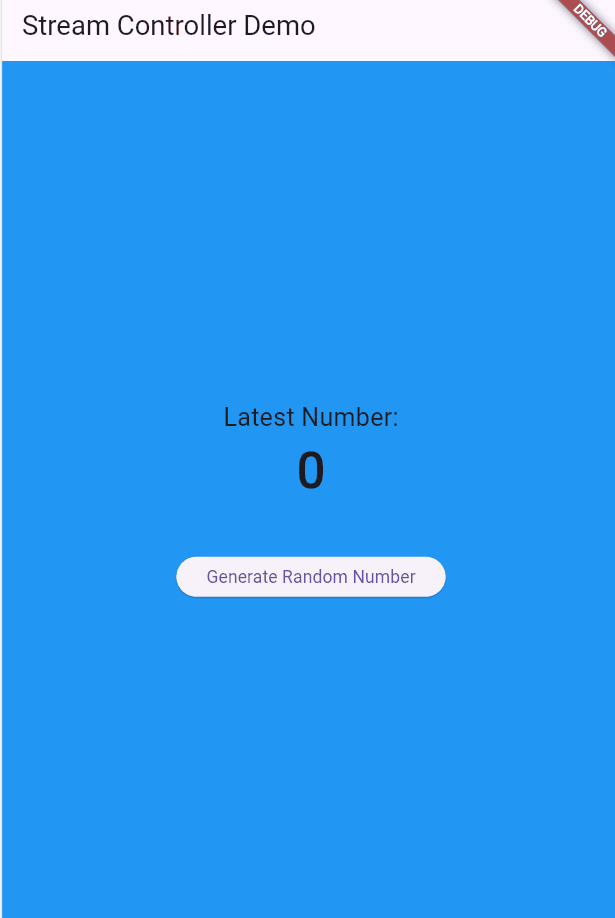
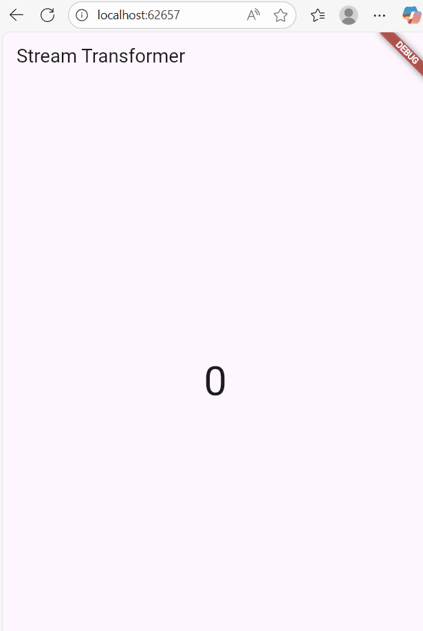
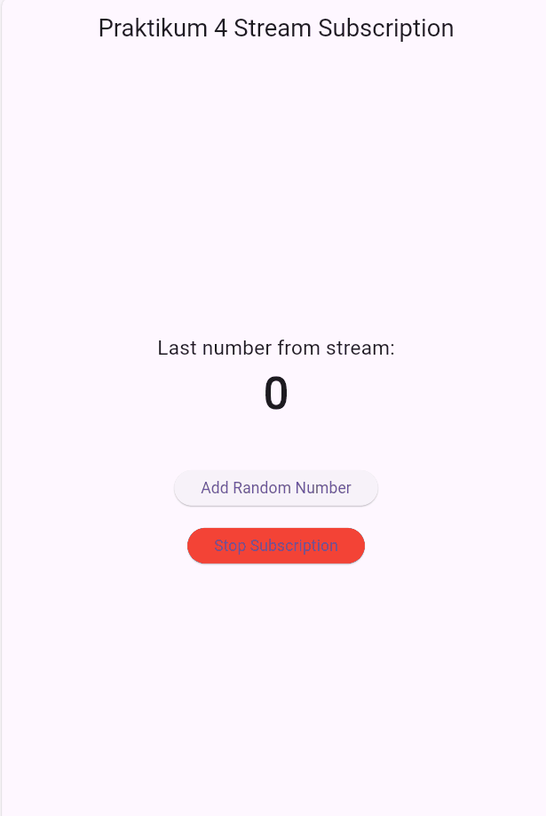
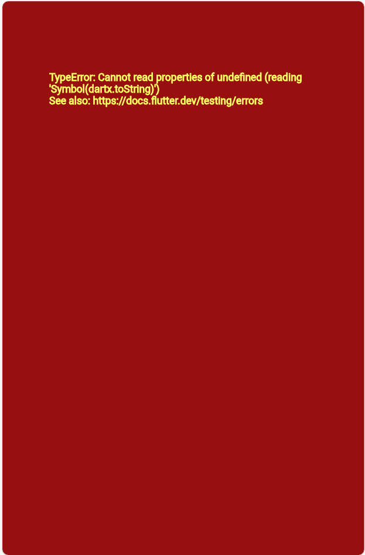
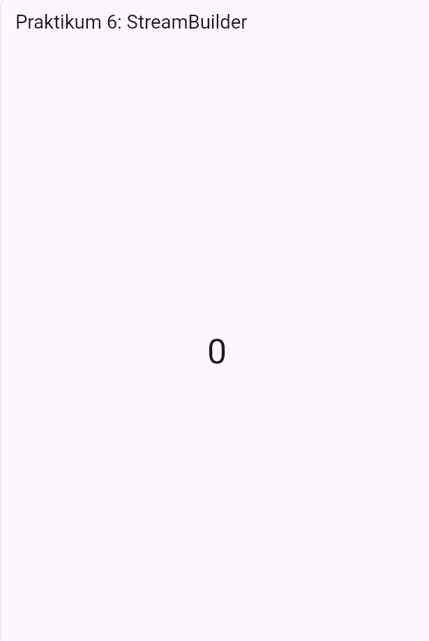
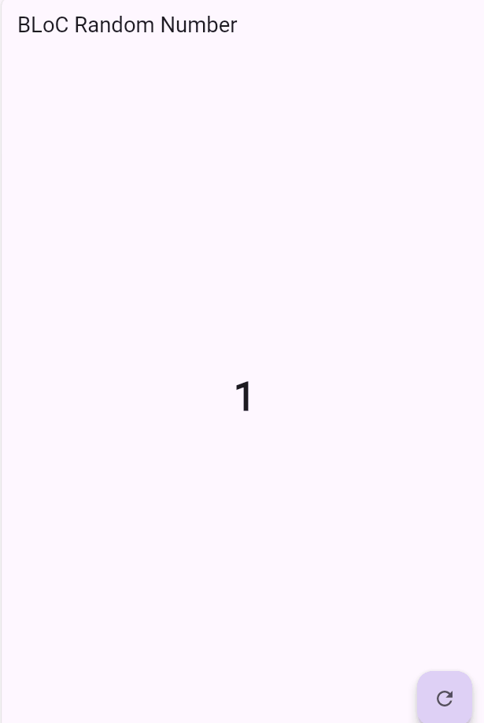

# Laporan Praktikum Codelabs #12
# Laporan Praktikum Flutter — State Management, Async, Stream, dan BLoC
## Identitas Mahasiswa
| Nama | Kelas | Absen |
|------|-------|-------|
| Faishal Harist Rahmawan | TI-3H | 10 |

## ✅ PRAKTIKUM 1 — Dasar State pada Flutter

 

### Soal
1. Apa fungsi dari `setState()`?  
2. Mengapa widget `Stateful` digunakan pada praktikum ini?  
3. Apa yang terjadi jika `setState()` tidak dipanggil?  

### Jawaban
- `setState()` berfungsi memberi tahu Flutter bahwa ada perubahan state sehingga widget harus dibangun ulang (rebuild).  
- `StatefulWidget` digunakan karena nilai (state) dapat berubah—misalnya counter, input, atau tampilan dinamis.  
- UI tidak akan diperbarui meskipun data berubah, sehingga aplikasi tampak tidak merespons.  

## ✅ PRAKTIKUM 2 — State dan Input Kontrol

### Soal
1. Apa fungsi dari `TextEditingController`?  
2. Mengapa harus memanggil `controller.dispose()`?  
3. Jelaskan alur kerja form input pada praktikum.  

### Jawaban
- `TextEditingController` digunakan untuk membaca, memantau, dan mengubah nilai teks dari `TextField`.  
- Untuk mencegah kebocoran memori (memory leak) karena controller tetap hidup meskipun widget dihapus.  
- User memasukkan teks → controller menyimpan data → tombol ditekan → `setState()` memperbarui tampilan sesuai nilai input.  

## ✅ PRAKTIKUM 3 — Widget ListView dan Card

 

### Soal
1. Jelaskan fungsi `ListView`.  
2. Mengapa `Card` digunakan dalam tampilan daftar?  
3. Apa perbedaan `ListView.builder` dengan `ListView` biasa?  

### Jawaban
- `ListView` digunakan untuk menampilkan data dalam bentuk daftar yang dapat di-scroll.  
- `Card` memberikan efek material design (bayangan, elevasi, sudut membulat) agar item daftar lebih rapi dan terstruktur.  
- `ListView.builder` lebih efisien karena hanya membangun item yang terlihat, sedangkan `ListView` biasa membangun semua item sekaligus.  

## ✅ PRAKTIKUM 4 — Navigation & Routing

### Soal
1. Apa fungsi `Navigator.push()`?  
2. Apa fungsi `Navigator.pop()`?  
3. Jelaskan perbedaan `push` dan `pushReplacement`.  

### Jawaban
- `Navigator.push()` memindahkan halaman ke halaman baru dan menambahkannya ke stack.  
- `Navigator.pop()` kembali ke halaman sebelumnya dengan menghapus halaman paling atas di stack.  
- `push()` menambahkan halaman baru, sedangkan `pushReplacement()` menggantikan halaman saat ini sehingga tidak dapat kembali.  

## ✅ PRAKTIKUM 5 — Future & Async Await

### Soal
1. Apa tujuan menggunakan `Future`?  
2. Apa manfaat `async/await` pada Flutter?  
3. Bagaimana cara kerja `FutureBuilder`?  

### Jawaban
- `Future` digunakan untuk menjalankan proses yang membutuhkan waktu (delay), seperti mengambil data API.  
- `async/await` membuat kode asynchronous lebih mudah dibaca dan ditulis.  
- `FutureBuilder` mendengarkan `Future`, membangun UI berdasarkan statusnya (loading, selesai, error).  

## ✅ PRAKTIKUM 6 — Stream

### Soal
1. Apa itu stream?  
2. Jelaskan perbedaan `Future` dan `Stream`.  
3. Bagaimana cara kerja `StreamBuilder`?  

### Jawaban
- Stream adalah aliran data yang mengirimkan nilai secara berulang (continuous).  
- `Future` hanya menghasilkan satu nilai sekali, sedangkan `Stream` bisa menghasilkan banyak data berkali-kali.  
- `StreamBuilder` mendengarkan stream dan melakukan rebuild UI setiap kali ada data baru.  

## ✅ PRAKTIKUM 7 — BLoC Pattern

### Soal
1. Apa tujuan BLoC?  
2. Di mana letak penerapan BLoC pada praktikum?  
3. Jelaskan bagaimana angka acak dapat berubah pada UI.  

### Jawaban
- Tujuan BLoC adalah memisahkan logika bisnis dari UI dan mengelola state menggunakan stream secara terstruktur.  
- Letak konsep BLoC terdapat pada file `random_bloc.dart` yang mengelola stream, sink, dan logic; serta `StreamBuilder` yang mengonsumsi stream.  
- Saat tombol ditekan → BLoC menghasilkan angka baru → menambahkannya ke stream → `StreamBuilder` otomatis rebuild → UI berubah.  
