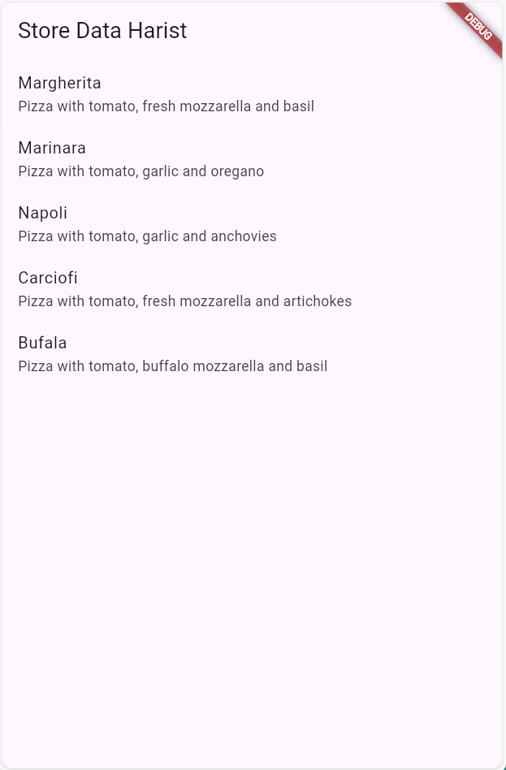
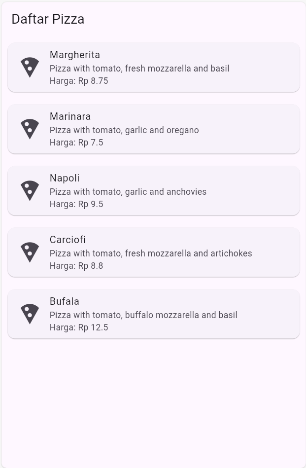
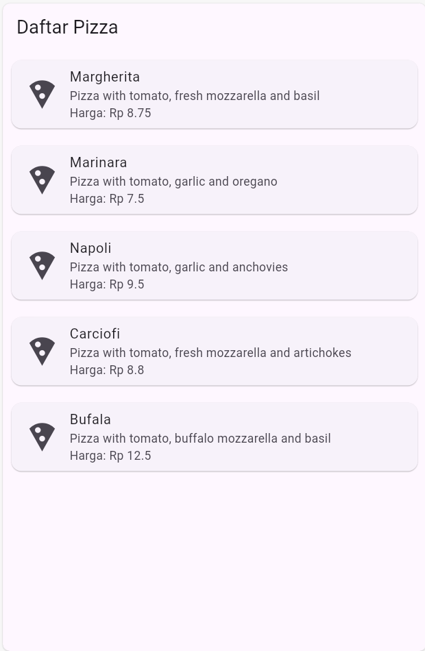
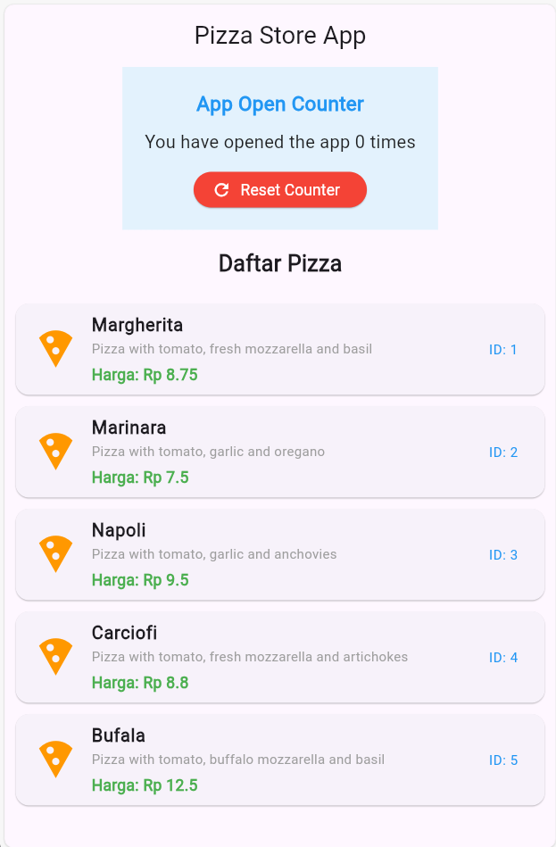
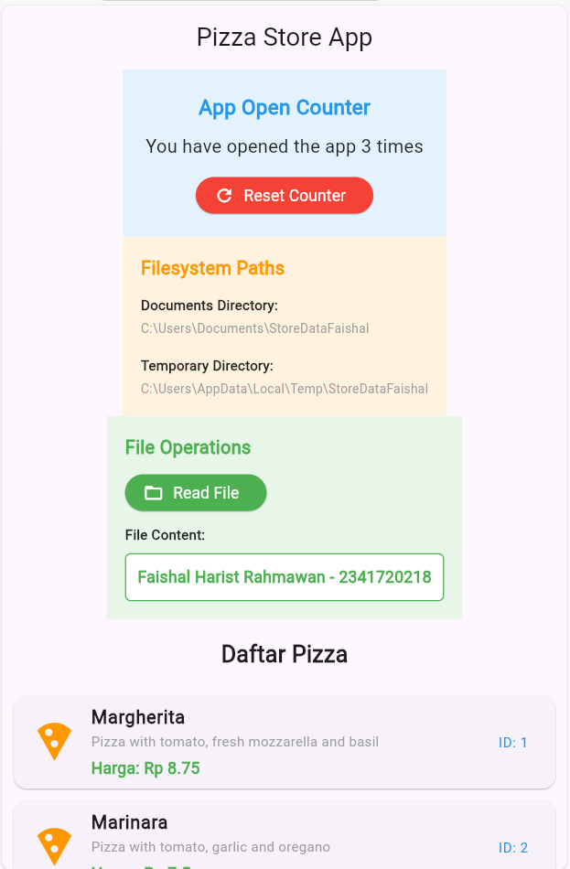

# Laporan Praktikum Codelabs #13
# Laporan Praktikum Flutter — State Management, Async, Stream, dan BLoC
## Identitas Mahasiswa
| Nama | Kelas | Absen |
|------|-------|-------|
| Faishal Harist Rahmawan | TI-3H | 10 |

# PRAKTIKUM 1: Load dan Parse Data JSON

## Tujuan
- Membaca file JSON dari assets
- Membuat model data Pizza
- Parse JSON menjadi object Dart
- Menampilkan data di UI dengan ListView

## Langkah-Langkah

1. Buat file `assets/pizzalist.json` dengan struktur pizza (id, pizzaName, description, price, imageUrl)
2. Buat model `Pizza` di `lib/model/pizza.dart`
3. Buat factory constructor `Pizza.fromJson()` untuk parse JSON
4. Buat method `loadJsonData()` di `main.dart` untuk load dan parse JSON dari assets
5. Tampilkan data pizza di ListView.builder
6. Jalankan aplikasi

## Hasil
✅ Aplikasi dapat membaca dan menampilkan daftar pizza dari JSON

### Output

---

# PRAKTIKUM 2: Handle Kompatibilitas Data JSON

## Tujuan
- Menangani data JSON yang tidak konsisten (tipe data berbeda)
- Handle field null atau missing
- Implement proper error handling
- Tampilkan data user-friendly

## Langkah-Langkah

1. Buat `pizzalist_broken.json` dengan data inconsistent (string ID, null fields, missing fields)
2. Update `Pizza.fromJson()` dengan type casting:
   - ID: cek apakah int, jika tidak gunakan `int.tryParse()` dengan default 0
   - String fields: gunakan `?.toString() ?? 'default'`
   - Price: cek apakah double, jika tidak gunakan `double.tryParse()` dengan default 0
3. Update UI dengan ternary operator untuk handle empty strings
4. Jalankan aplikasi

## Hasil
✅ Aplikasi dapat menangani data tidak konsisten tanpa crash

### Output

---

# PRAKTIKUM 3: Konstanta untuk JSON Keys

## Tujuan
- Mengganti string literals dengan konstanta
- Menghindari typo pada JSON keys
- Meningkatkan code safety dan maintainability

## Langkah-Langkah

1. Deklarasikan konstanta di atas class `Pizza`:
   - `const String keyId = 'id'`
   - `const String keyPizzaName = 'pizzaName'`
   - `const String keyDescription = 'description'`
   - `const String keyPrice = 'price'`
   - `const String keyImageUrl = 'imageUrl'`
2. Update `Pizza.fromJson()` menggunakan konstanta (replace `json['key']` dengan `json[keyXxx]`)
3. Update `Pizza.toJson()` menggunakan konstanta
4. Jalankan aplikasi

## Hasil
✅ Code lebih safe dari typo dan mudah di-maintain

### Output

---

# PRAKTIKUM 4: SharedPreferences Counter

## Tujuan
- Menyimpan dan membaca data dari local storage
- Membuat app counter yang persist
- Implementasi reset counter

## Langkah-Langkah

1. Tambah dependensi: `flutter pub add shared_preferences`
2. Import: `import 'package:shared_preferences/shared_preferences.dart'`
3. Deklarasikan variabel: `int appCounter = 0`
4. Buat method `readAndWritePreference()`:
   - Baca counter dari storage dengan `prefs.getInt(key) ?? 0`
   - Increment dan simpan dengan `prefs.setInt(key, newValue)`
   - Update state
5. Buat method `deletePreference()`:
   - Clear semua data dengan `prefs.clear()`
   - Reset counter ke 0
6. Panggil di `initState()`
7. Tambahkan UI section dengan blue background menampilkan counter dan tombol reset
8. Jalankan aplikasi

## Hasil
✅ Counter bertambah setiap app dibuka dan tetap persist

### Output

---

# PRAKTIKUM 5: Akses Filesystem dengan path_provider

## Tujuan
- Akses direktori dokumen aplikasi
- Akses direktori temporary files
- Tampilkan jalur absolut ke kedua direktori

## Langkah-Langkah

1. Tambah dependensi: `flutter pub add path_provider`
2. Import: `import 'package:path_provider/path_provider.dart'`
3. Deklarasikan variabel: `String documentsPath = ''` dan `String tempPath = ''`
4. Buat method `getPaths()`:
   - Gunakan `getApplicationDocumentsDirectory()` untuk documents path
   - Gunakan `getTemporaryDirectory()` untuk temp path
   - Update state dengan paths
5. Panggil di `initState()`
6. Tambahkan UI section dengan orange background menampilkan kedua path
7. Jalankan aplikasi

## Hasil
✅ Aplikasi menampilkan jalur direktori dengan benar di UI

### Output

---

# PRAKTIKUM 6: File Operations - Write & Read File

## Tujuan
- Menulis data ke file
- Membaca data dari file
- Menampilkan file content di UI

## Langkah-Langkah

1. Deklarasikan variabel: `late File myFile` dan `String fileText = ''`
2. Buat method `_initializeFile()`:
   - Tunggu dengan `Future.delayed()`
   - Buat File object dengan path dari documentsPath
   - Panggil `writeFile()`
3. Buat method `writeFile()`:
   - Tulis user data ke file dengan `myFile.writeAsString()`
   - Tambah error handling
4. Buat method `readFile()`:
   - Baca content dengan `myFile.readAsString()`
   - Update fileText state
   - Tambah error handling
5. Panggil `_initializeFile()` di `initState()`
6. Tambahkan UI section dengan green background:
   - Tombol "Read File"
   - Tampilkan file content setelah button ditekan
7. Jalankan aplikasi

## Hasil
✅ Aplikasi dapat write dan read file dengan benar

### Output

---

## Ringkasan

| Praktikum | Focus | Package | Key Method |
|-----------|-------|---------|-----------|
| 1 | Load & Parse JSON | dart:convert | loadJsonData() |
| 2 | Handle Inconsistent Data | dart:convert | Type casting, null coalescing |
| 3 | Code Quality | - | Constants |
| 4 | Local Storage | shared_preferences | readAndWritePreference() |
| 5 | Filesystem Access | path_provider | getPaths() |
| 6 | File Operations | dart:io | writeFile(), readFile() |

**User**: Faishal Harist Rahmawan - 2341720218
